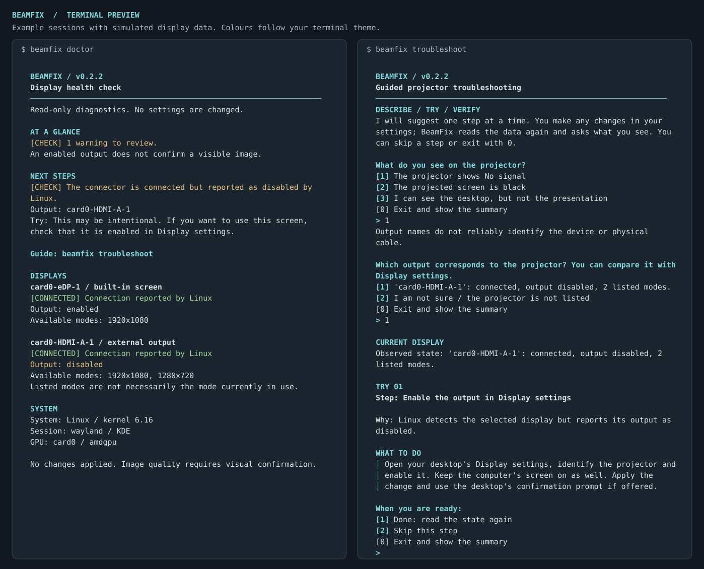

# BeamFix

Local diagnostics for monitors and projectors on Linux. The goal is a simple
workflow: connect the projector, run BeamFix, try a fix and confirm the result.

**Status: guided troubleshooting, v0.2.5.** The `doctor` command collects data and
reports potential issues; `troubleshoot` guides one step at a time and checks the
outcome with the user. Automatic fixes and a graphical interface are on the roadmap.



*Example terminal output using simulated display data. Actual colours follow your
terminal theme.*

## Quick start

Requires Linux and Python 3.11 or later. From the repository directory:

```bash
python3 -m beamfix doctor
python3 -m beamfix doctor --json
python3 -m beamfix troubleshoot
```

No additional Python runtime dependencies, Internet access, external services or
API keys are needed. For current modes, both commands optionally use installed
`kscreen-doctor` on KDE, or `wayland-info` on Wayland sessions. BeamFix does not
install these tools automatically, require `sudo`, or change the resolution,
drivers or desktop configuration.

To install the command in a virtual environment (requires `venv` and `pip`):

```bash
python3 -m venv .venv
.venv/bin/python -m pip install .
.venv/bin/beamfix doctor
.venv/bin/beamfix troubleshoot
```

Installation may download build tools; BeamFix itself runs offline. If you have
already installed an earlier version, run `.venv/bin/python -m pip install .`
again to update the command in the virtual environment. Running
`python3 -m beamfix` from the repository directory uses the local source directly.

## Current resolution and refresh rate

On KDE, `doctor` reads the current configuration through `kscreen-doctor --json`
and shows the configured mode for each uniquely matched Linux output:

```text
Current mode: 3840 x 2160 @ 60.00 Hz
[LISTED] Current mode is listed as available by KDE.
```

The resolution and refresh rate are checked together using the current mode ID.
The green `LISTED` label means that KDE includes this mode in its available
list; it does not guarantee that the projector displays a correct image or that
the mode was advertised by the monitor rather than added manually.

On other Linux Wayland desktops, and when the KDE query is unavailable, BeamFix
reads standard `wl_output` data using `wayland-info -i wl_output`. This path does
not depend on the desktop name. If `wayland-info` is installed and the session
exposes uniquely matching output names and a readable current mode, it shows:

```text
Current mode: 3840 x 2160 @ 60.00 Hz
[REPORTED] Current mode reported by Wayland; the available mode list is not verified.
```

`REPORTED` is informational (cyan), distinct from green `LISTED`. Standard Wayland
reports the session's current mode but does not guarantee an alternative-mode
list or expose disabled outputs. Virtual outputs may report synthetic values.
BeamFix retains the independent Linux DRM observations and never treats absence
from Wayland as proof of disconnection. It does not guess aliases or match names
that are duplicated across GPUs. Missing names, unknown/zero refresh rates,
unreadable records and conflicting Linux/Wayland state remain `UNVERIFIED`.

KDE's valid configuration response takes precedence, including any ambiguous or
conflicting entries: a fallback must not conceal those uncertainties. The
Wayland fallback is used when the KDE command is absent, fails, times out or
returns an unreadable configuration. On KDE/X11 only the KDE backend is used;
other X11 desktops retain basic DRM diagnostics. A generic RandR backend is not
yet implemented. Both queries are read-only with a five-second timeout each.

Disabled/disconnected outputs are labelled `Inactive` when supported by the
observations. Previous modes are never reused as a fresh reading. Yellow
`UNVERIFIED` means that the current mode cannot be established, not that it is
incompatible. Missing optional tools never prevent the basic DRM diagnostics.

The values describe pixel resolution and refresh rate reported by the session,
not the scaled desktop size or instantaneous refresh under variable refresh rate
(VRR). An unverified current mode makes `doctor` return `2` (incomplete
observation), while preserving the other diagnostic results. A readable
`REPORTED` mode alone does not make the observation incomplete or establish
visual success.

Both backends have been checked on KDE/Wayland, including agreement on the
current mode. Other Wayland desktops are covered by simulated tests only;
compatibility still requires real-session testing. The `wayland-info` adapter
parses its text output conservatively; an unsupported output format remains
unverified. Older Wayland outputs without names cannot be matched.

## Terminal presentation

The CLI uses your terminal's colour palette, with clear section headings,
numbered choices and wrapped text. Diagnostic reports put the overall result and
next steps before hardware details. Guided checks separate the reason for each
step, what to do, and verification of the result.

- Cyan highlights headings, choices and the next action.
- Amber marks warnings, unknown data and unconfirmed outcomes.
- Green marks a detected connection, a current mode listed by KDE, or an image
  explicitly confirmed by the user; the accompanying label always says which one.
- Status labels remain meaningful without colour. No special fonts are required.

Colours are enabled automatically in a terminal. Redirected or piped output is
plain text. Set `NO_COLOR` to disable colour, or pass `--plain` to also remove
decorative characters:

```bash
python3 -m beamfix doctor --plain
python3 -m beamfix troubleshoot --plain
```

`TERM=dumb` also selects plain output. JSON output is always unstyled. The CLI
keeps normal terminal scrolling and numbered input; it does not clear the screen
or require an additional terminal UI library.

## Guided troubleshooting: projector connected, image missing or unexpected

Run `python3 -m beamfix troubleshoot` in a terminal on the computer connected to
the projector. Use the numbered options to describe what you see: No signal, a
black screen, or the desktop without the presentation. Then select the projector
output. If you cannot identify it, you can say so instead of guessing another monitor.

BeamFix suggests one step relevant to the available data: checking the projector
input or connection, enabling the output, selecting the presentation screen,
mirroring, or trying another video mode. You make any changes manually in your
desktop settings: BeamFix neither applies nor rolls them back.

When available, the guided readings also include the selected output's configured
resolution and refresh rate. When suggesting a different mode, BeamFix shows
the observed mode and asks you to check it in Display settings before changing
it. Each completed step queries the desktop again, and the summary retains the before/after
values, including changes in refresh rate at the same resolution. An inactive
output or an unavailable mode is labelled explicitly; previous values are never
carried forward as a new observation. If current-mode data are unavailable, the basic
guided checks continue. A mode listed by KDE or reported by Wayland does not confirm a correct image.

After you choose Done, BeamFix reads the state again and asks what you see. If the
symptom changes, the next step changes accordingly. A completed or skipped step
is not offered again within the same session. If a connection change requires
identifying a new output, BeamFix asks you to select it explicitly. You can skip
unavailable steps and exit at any time with `0` or Ctrl+C.

The summary distinguishes completed and skipped steps, before/after observations
and visual results. A solution is confirmed only when you report seeing the
expected image; an enabled output is not enough. A failed step alone does not
prove a hardware fault, and a skipped step does not rule out any cause.

Exit codes for `troubleshoot`: `0` means the user confirmed the expected image;
`1` means the problem remains after the available steps; `2` means insufficient
data or visual verification, or an interrupted session. These meanings differ
from the exit codes for `doctor`. The summary stays in the terminal and is not
saved or sent automatically. The guided command has no JSON option; a technical
report is available through `doctor --json`.

## What BeamFix checks today

- Operating system, kernel, reported session type and desktop.
- DRM graphics cards and driver names, when available.
- Connectors, connection state, output enablement and listed video modes.
- Current resolution and Hz through KDE or standard Wayland, with explicit source and status.
- Connected but disabled outputs, missing modes and inaccessible data.
- An English terminal report or JSON with a schema version and diagnostic codes.

BeamFix reads `/sys/class/drm`, optional KDE/Wayland observations, and two session variables:
`XDG_SESSION_TYPE` and `XDG_CURRENT_DESKTOP`. Only the required output-state and
mode fields are retained; raw tool responses, descriptions, EDID data, serial numbers,
profile paths, hostnames, accounts and system logs are not included in reports.
Reports are not saved or sent
automatically. Reports still contain hardware and environment details: review
them before sharing.

## Limitations

An enabled output does not prove that the image is visible or correct. This
version can read resolution and Hz from KDE or Wayland, but does not measure
instantaneous refresh, scaling, audio, HDCP or cable quality. It cannot reliably distinguish a monitor from a projector.
USB-C may appear as DisplayPort: the DRM connector type does not identify the
physical cable.

The data are a kernel observation and may be incomplete or change during
connection. A listed mode is not necessarily the active mode. BeamFix does not
force a display rescan. Basic DRM checks are independent of the desktop; current-mode
observation uses KDE or standard Wayland backends. Compatibility with specific drivers and devices
requires hardware testing.

Exit codes for `doctor`: `0` means no issues were detected by the available
checks; `1` indicates warnings; `2` indicates incomplete observations or an
unknown state. CLI syntax errors also return `2`. A `doctor` exit code of `0`
does not mean that projection has been visually verified. Disconnected ports
may be normal; interpret warnings in relation to the display you expected to find.

## Development

```bash
python3 -m unittest discover -s tests -v
```

Tests use simulated devices and do not modify the graphics system. GitHub Actions
runs tests and verifies installation on Python 3.11 and 3.14.
See the [architecture](docs/architecture.md) and [roadmap](docs/roadmap.md).

The interface, documentation and GitHub contributions use English. Keep commit
messages, issue descriptions and pull requests in English as well.

The project is under private development. A distribution license has not yet
been selected.
